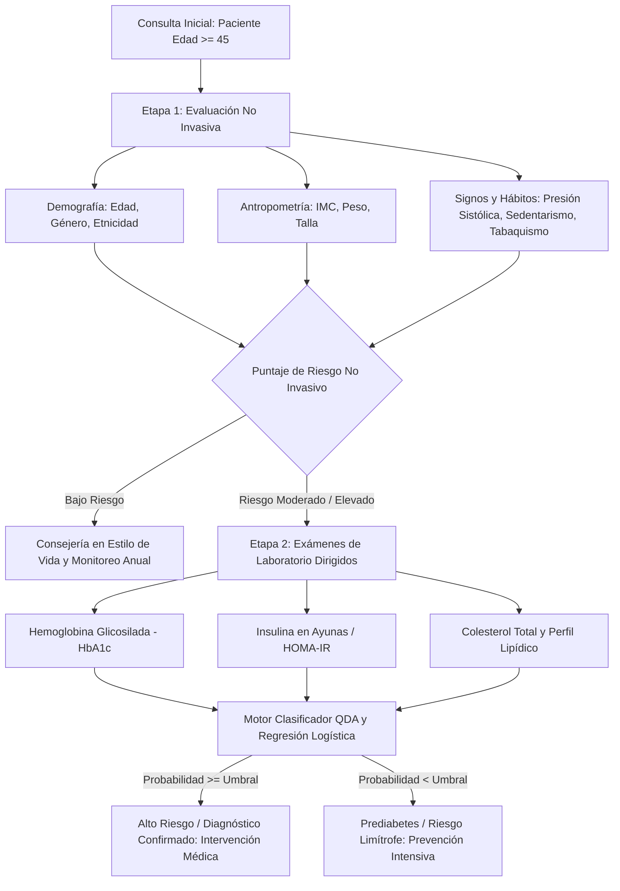

# Análisis de Factores Demográficos, Clínicos y de Estilo de Vida en la Predicción del Riesgo de Diabetes: Modelado Estadístico Multivariado y Machine Learning

[](https://www.r-project.org/)
[](https://rmarkdown.rstudio.com/)
[](https://wwwn.cdc.gov/nchs/nhanes/continuousnhanes/default.aspx?BeginYear=2013)
[](https://opensource.org/licenses/MIT)
[]()

> **Versiones de Idioma:** [English](README.md) | [Español](README.es.md)

---

## Resumen Ejecutivo

La Diabetes Mellitus Tipo 2 (DMT2) constituye uno de los desafíos más críticos de la salud pública contemporánea, caracterizada por hiperglucemia crónica, resistencia a la insulina y complicaciones metabólicas y cardiovasculares progresivas. El diagnóstico clínico convencional descansa en biomarcadores invasivos obtenidos por punción venosa —principalmente Hemoglobina Glicosilada ($\text{HbA1c}$), Glucosa Plasmática en Ayunas y la Prueba de Tolerancia Oral a la Glucosa—. No obstante, el tamizaje universal invasivo en atención primaria suele verse limitado por barreras económicas, tiempos de respuesta de laboratorio y saturación de los servicios de salud.

Este proyecto formula un **marco metodológico integral de análisis estadístico multivariado y aprendizaje automático** para evaluar cómo variables accesibles y no invasivas (demográficas, antropométricas y de estilo de vida) pueden orientar la toma de decisiones clínicas y optimizar la solicitud de pruebas de laboratorio especializadas. Utilizando la encuesta **NHANES 2013–2014 de los CDC de EE. UU.** restringida a adultos de mediana y avanzada edad ($\text{Edad} \ge 45$ años, $N = 3.174$), se implementa:
1. **Análisis Multivariado de Varianza (MANOVA)** para demostrar diferencias globales altamente significativas en los perfiles metabólicos entre diabéticos y no diabéticos ($p < 2.2 \times 10^{-16}$).
2. **Análisis Factorial Exploratorio (AFE / EFA)** con rotación oblicua (Direct Oblimin), identificando 3 dimensiones latentes fisiopatológicas: *Factor Dietario*, *Envejecimiento Vascular* y *Núcleo Metabólico/Clínico*.
3. **Análisis de Componentes Principales (ACP / PCA)** reteniendo 4 componentes ortogonales que explican el $69.7\%$ de la varianza total.
4. **Análisis Discriminante Cuadrático (ADC / QDA)** justificando la heterocedasticidad de covarianzas y balanceando clases mediante sobremuestreo (*up-sampling*), alcanzando una exactitud global del **$84.72\%$**, una especificidad del **$94.27\%$** y un Valor Predictivo Negativo (VPN) del **$87.09\%$**.
5. **Regresión Logística Binaria Jerárquica** contrastando un modelo básico no invasivo ($\text{AUC} = 0.6497, \text{AIC} = 813.99$) frente al modelo completo con analítica clínica ($\text{AUC} = 0.8765, \text{AIC} = 564.65$), demostrando que la $\text{HbA1c}$ es el predictor preponderante ($\text{OR} \approx 6.69$).

Como síntesis clínica se propone un **Protocolo de Tamizaje en Dos Etapas**: triage comunitario no invasivo seguido de validación diagnóstica dirigida priorizando $\text{HbA1c}$ y perfil lipídico.



---

## Autores y Contexto Académico

* **Autores:**
  * **Samuel Santiago Arandia Barragán**
  * **Juan David Castañeda Betancourt**
  * **Juan Felipe Rojas Manjarres**
* **Institución:** Universidad del Rosario (Bogotá, Colombia)
* **Asignatura:** *Análisis Estadístico de Datos (AED)* — Periodo 2026-1
* **Docente Directora:** Prof. Luz Adriana Pineda
* **Repositorio:** [https://github.com/JuanFeletes24/AED_PROJECT](https://github.com/JuanFeletes24/AED_PROJECT)
* **Documento del Artículo Completo:** [`docs/AED.pdf`](docs/AED.pdf)

---

## Pregunta de Investigación e Hipótesis

### Pregunta Central
> *¿En qué medida las variables básicas —demográficas, medidas corporales, actividad física y dieta— permiten orientar la selección de exámenes clínicos relevantes y, a partir de estos, estimar con alta precisión la probabilidad de padecer diabetes en adultos a partir de la mediana edad?*

### Hipótesis Estadísticas
* **Hipótesis 1 (Separación Multivariada):** El vector de medias multivariado $\boldsymbol{\mu}_{\text{diabético}}$ difiere significativamente de $\boldsymbol{\mu}_{\text{no\_diabético}}$ en el espacio conjunto de biomarcadores metabólicos, cardiovasculares y nutricionales ($H_0: \boldsymbol{\mu}_1 = \boldsymbol{\mu}_2$).
* **Hipótesis 2 (Estructura Latente):** Las intercorrelaciones observadas se estructuran en dimensiones latentes diferenciadas correspondientes a ingesta calórica/dietaria, deterioro vascular por envejecimiento y desregulación glucémica.
* **Hipótesis 3 (Sinergia Diagnóstica):** Aunque los predictores no invasivos ofrecen una capacidad de triage apreciable ($\text{AUC} \approx 0.65$), la integración dirigida con biomarcadores de laboratorio eleva la discriminación a niveles diagnósticos de alta sensibilidad y especificidad ($\text{AUC} \ge 0.87$).

---

## Arquitectura de los Datos y Depuración

Se extrajeron microdatos de la encuesta **NHANES 2013–2014** del National Center for Health Statistics (CDC). Se integraron cinco módulos temáticos mediante la clave primaria `SEQN`:

```
+---------------------------------------------------------------------------------------+
|                               CDC NHANES 2013–2014                                    |
|                   (Muestra Inicial Total: N = 10.175 individuos)                      |
+-------------------+-------------------+-------------------+-------------------+-------+
        |                   |                   |                   |                   |
        v                   v                   v                   v                   v
+---------------+   +---------------+   +---------------+   +---------------+   +---------------+
| cuestionario  |   | laboratorio   |   |   examen      |   |  demográfico  |   |     dieta     |
| (DIQ, SMQ,    |   | (HbA1c,       |   | (IMC, Presión |   | (Edad, Sexo,  |   | (Carbohidratos|
|    PAQ)       |   | Insulina, TC) |   | Peso, Talla)  |   |  Etnicidad)   |   |    Fibra)     |
+---------------+   +---------------+   +---------------+   +---------------+   +---------------+
        |                   |                   |                   |                   |
        +-------------------+--------+----------+-------------------+-------------------+
                                     |
                                     v Inner Join por Llave Primaria: SEQN
                    +-----------------------------------+
                    |   Tabla Maestra Multimodal        |
                    +-----------------------------------+
                                     |
                                     v Filtro Poblacional: RIDAGEYR >= 45 años
                    +-----------------------------------+
                    | Cohorte Objetivo: N = 3.174 obs   |
                    +-----------------------------------+
                                     |
                                     v Depuración de Casos Completos / Imputación
                    +-----------------------------------+
                    | Base Analítica Multivariada       |
                    | (N = 1.202 observaciones totales) |
                    +-----------------------------------+
```

### Diccionario de Variables

| Código NHANES | Nombre Estandarizado | Módulo | Tipo de Escala | Definición Clínica / Operacional | Rango / Unidades |
| :--- | :--- | :--- | :--- | :--- | :--- |
| `SEQN` | `Id` | Llave Maestra | Nominal Discreta | Secuencia única de identificación del participante | $73557 - 83731$ |
| `DIQ010` | `Diabetes_diagnostized`| Cuestionario | Categórica Nominal | Diagnóstico médico previo de diabetes | `1` = Sí, `2` = No, `3` = Prediabetes |
| `SMQ020` | `Smoked_100_cigarrette`| Cuestionario | Categórica Nominal | Hábito tabáquico histórico ($\ge 100$ cigarrillos) | `1` = Sí, `2` = No |
| `PAQ650` | `Sport` | Cuestionario | Categórica Nominal | Realización de actividad física intensa / deportes | `1` = Sí, `2` = No |
| `RIAGENDR` | `Gender` | Demográfico | Categórica Nominal | Sexo biológico del participante | `Male`, `Female` |
| `RIDRETH3` | `Etnicity` | Demográfico | Categórica Nominal | Origen étnico / racial recodificado | 6 categorías |
| `DMDEDUC2` | `Education` | Demográfico | Categórica Ordinal | Nivel educativo máximo alcanzado | 5 categorías ordenadas |
| `RIDAGEYR` | `Age` | Demográfico | Razón Continua | Edad cronológica al momento del examen | $\ge 45$ años ($45 - 80$) |
| `BMXWT` | `Weight` | Examen Físico | Razón Continua | Peso corporal | $\text{kg}$ |
| `BMXHT` | `Height` | Examen Físico | Razón Continua | Estatura de pie | $\text{cm}$ |
| `BMXBMI` | `BMI` | Examen Físico | Razón Continua | Índice de Masa Corporal ($\text{kg}/\text{m}^2$) | Normal: $18.5 - 24.9$ |
| `BPXSY1` | `Blood_pressure` | Examen Físico | Razón Continua | Presión arterial sistólica (1.ª lectura) | $\text{mmHg}$ |
| `LBXGH` | `Glycohemoglobin` | Laboratorio | Razón Continua | Porcentaje de hemoglobina glicosilada ($\text{HbA1c}$) | Normal: $< 5.7\%$, Diabetes: $\ge 6.5\%$ |
| `LBXTC` | `Cholesterol` | Laboratorio | Razón Continua | Colesterol total sérico | Normal: $< 200\text{ mg/dL}$ |
| `LBXIN` | `Insulina` | Laboratorio | Razón Continua | Insulina sérica en ayunas | $\mu\text{IU/mL}$ |
| `DR1TCARB` | `Carbohydrate` | Recordatorio 24h | Razón Continua | Ingesta diaria total de carbohidratos | $\text{gramos/día}$ |
| `DR1TFIBE` | `Fiber` | Recordatorio 24h | Razón Continua | Ingesta diaria total de fibra dietética | $\text{gramos/día}$ |

---

## Análisis Exploratorio y Hallazgos Principales

### 1. Desbalance en la Variable de Respuesta
En el subconjunto de personas $\ge 45$ años:
* **Sin Diabetes ($76.2\%$):** Individuos sanos / sin diagnóstico ($N = 2.419$).
* **Con Diagnóstico ($19.5\%$):** Diabetes confirmada ($N = 619$).
* **Prediabetes / Limítrofe ($4.2\%$):** Alteración glucémica intermedia ($N = 133$).
* **Implicación Metodológica:** Una predicción ingenua de la clase mayoritaria obtendría $76.2\%$ de exactitud, pero carecería de utilidad médica. Para mitigar esto, se reestructuró en **$\text{Risk}$** ($1$) vs **$\text{No\_Risk}$** ($0$) y se balanceó el conjunto de entrenamiento mediante sobremuestreo (*up-sampling*).

### 2. Impacto de la Actividad Física y Sedentarismo
El cruce de contingencia evidenció una brecha de riesgo contundente:
* **Población Sedentaria:** Prevalencia de diabetes del $\approx 21.0\%$.
* **Población con Actividad Física Regular:** Prevalencia de diabetes del $\approx 9.6\%$.
* *Conclusión:* El sedentarismo **duplica holgadamente ($2.18\times$)** el riesgo relativo de presentar diabetes en esta cohorte.

### 3. Distribución y Asimetría de Biomarcadores
* **$\text{HbA1c}$:** Asimetría positiva pronunciada. La mediana muestral se ubica próxima al umbral de prediabetes, y la cola derecha presenta una estabilidad y capacidad discriminante sobresaliente.
* **Insulina, Carbohidratos y Fibra:** Alta variabilidad interindividual y colas derechas extendidas, reflejando amplia heterogeneidad en el comportamiento nutricional y la respuesta fisiológica pancreática.
* **Presión Sistólica e IMC:** Distribuciones con desplazamiento hacia la derecha y medianas e IQRs marcadamente más altos en el grupo con diabetes.

---

## Pruebas de Hipótesis Multivariadas y MANOVA

### 1. Verificación de Supuestos
* **Normalidad Multivariada (Prueba de Mardia):** Rechazo de la normalidad multivariada ($p < 0.001$), atribuible a la asimetría de insulina y variables nutricionales.
* **Homogeneidad de Matrices de Covarianza (Prueba M de Box):**
  $$\text{Box's } M = 293.42, \quad F \approx 36.19, \quad p < 2.2 \times 10^{-16}$$
  Se rechaza categóricamente la igualdad de covarianzas entre grupos ($H_0: \boldsymbol{\Sigma}_{\text{Risk}} = \boldsymbol{\Sigma}_{\text{No\_Risk}}$). **Este hallazgo invalida el Análisis Discriminante Lineal (LDA) y fundamenta la selección obligatoria del Análisis Discriminante Cuadrático (QDA).**

### 2. Análisis Multivariado de Varianza (MANOVA)
Evaluación del contraste de centroides entre grupos a lo largo de 8 variables cuantitativas:

$$\text{Traza de Pillai} = 0.3596, \quad F(8, 1193) = 83.75, \quad p < 2.2 \times 10^{-16}$$

$$\text{Lambda de Wilks } \Lambda = 0.6404, \quad F(8, 1193) = 83.75, \quad p < 2.2 \times 10^{-16}$$

### 3. ANOVAs Univariados de Seguimiento
Las pruebas univariadas con ajuste por heterocedasticidad (test de Levene) ratificaron diferencias individuales críticas:
* **$\text{HbA1c}$ ($F = 562.4, p < 10^{-15}$):** Biomarcador con mayor capacidad de separación univariada.
* **Insulina ($F = 114.8, p < 10^{-15}$):** Marcador clave de hiperinsulinemia y resistencia a la insulina.
* **IMC ($F = 46.2, p = 1.6 \times 10^{-11}$):** Factor de riesgo antropométrico primario.
* **Presión Sistólica ($F = 28.7, p = 1.0 \times 10^{-7}$):** Comorbilidad vascular asociada.
* **Edad ($F = 19.4, p = 1.1 \times 10^{-5}$):** Efecto biológico acumulativo del envejecimiento.

---

## Reducción de Dimensionalidad: AFE y ACP

### 1. Análisis Factorial Exploratorio (AFE / EFA)
* **Criterio de Retención:** Análisis Paralelo de Horn indicando **3 factores latentes**.
* **Extracción y Rotación:** Máxima Verosimilitud con rotación oblicua **Direct Oblimin** ($\delta = 0$), explicando el $42.1\%$ de la varianza compartida.

| Dimensión Latente | Variable | Carga Factorial ($\lambda_j$) | Unicidad ($u_j^2$) | Interpretación Fisiopatológica |
| :--- | :--- | :--- | :--- | :--- |
| **Factor 1 ($\text{ML}1$)**<br>*Núcleo Metabólico y Glucémico* | Insulina (`LBXIN`)<br>IMC (`BMXBMI`)<br>$\text{HbA1c}$ (`LBXGH`) | **0.74**<br>**0.45**<br>**0.42** | 0.44<br>0.79<br>0.82 | Refleja la resistencia aguda a la insulina, sobrecarga adiposa y control glucémico crónico. |
| **Factor 2 ($\text{ML}2$)**<br>*Envejecimiento y Deterioro Vascular* | Presión Sistólica (`BPXSY1`)<br>Edad (`RIDAGEYR`)<br>Colesterol Total (`LBXTC`) | **0.66**<br>**0.52**<br>**0.29** | 0.56<br>0.72<br>0.91 | Captura la rigidez arterial progresiva, pérdida de distensibilidad vascular y perfil lipídico. |
| **Factor 3 ($\text{ML}3$)**<br>*Ingesta Nutricional y Dieta* | Carbohidratos (`DR1TCARB`)<br>Fibra Dietaria (`DR1TFIBE`) | **0.98**<br>**0.65** | 0.03<br>0.57 | Representa el volumen de consumo calórico, carga glicémica de la dieta y aporte de fibra. |

### 2. Análisis de Componentes Principales (ACP / PCA)
* **Criterio de Kaiser-Guttman:** 4 componentes principales presentaron autovalores $\lambda_k > 1.0$, acumulando conjuntamente el **$69.7\%$** de la varianza total:
  * **$\text{CP}_1$ ($21.8\%$ var):** Magnitud nutricional y dietaria (Carbohidratos y Fibra).
  * **$\text{CP}_2$ ($18.4\%$ var):** Sobrecarga metabólica y glucémica ($\text{HbA1c}$, Insulina, IMC).
  * **$\text{CP}_3$ ($15.1\%$ var):** Envejecimiento cardiovascular (Edad, Presión Sistólica).
  * **$\text{CP}_4$ ($14.4\%$ var):** Dimensión lipídica (Colesterol Total).

---

## Modelación Predictiva y Clasificación

### 1. Análisis Discriminante Cuadrático (ADC / QDA)

Al comprobarse heterogeneidad en las covarianzas ($\boldsymbol{\Sigma}_1 \neq \boldsymbol{\Sigma}_2$), la frontera de decisión cuadrática se modeló según:

$$\delta_k(\mathbf{x}) = -\frac{1}{2} \ln |\boldsymbol{\Sigma}_k| - \frac{1}{2} (\mathbf{x} - \boldsymbol{\mu}_k)^T \boldsymbol{\Sigma}_k^{-1} (\mathbf{x} - \boldsymbol{\mu}_k) + \ln \pi_k$$

* **Partición de Datos:** $70\%$ Entrenamiento ($N = 842$), $30\%$ Prueba ($N = 360$).
* **Balanceo de Clases:** Sobremuestreo estratificado (*up-sampling*) de la clase minoritaria generando un conjunto de entrenamiento balanceado con $N_{\text{train}} = 1.864$ observaciones.

#### Métricas de Rendimiento en Prueba ($N = 360$)

| Métrica de Evaluación | Expresión Matemática | Valor Obtenido | Intervalo de Confianza (95%) |
| :--- | :--- | :--- | :--- |
| **Exactitud Global (Accuracy)** | $\frac{VP + VN}{N}$ | **84.72%** | $[80.58\%, 88.28\%]$ |
| **Especificidad** | $\frac{VN}{VN + FP}$ | **94.27%** | $[90.75\%, 96.76\%]$ |
| **Valor Predictivo Negativo (VPN)** | $\frac{VN}{VN + FN}$ | **87.09%** | $[82.68\%, 90.72\%]$ |
| **Sensibilidad (Recall)** | $\frac{VP}{VP + FN}$ | **51.85%** | $[40.75\%, 62.81\%]$ |
| **Valor Predictivo Positivo (VPP)** | $\frac{VP}{VP + FP}$ | **72.41%** | $[59.10\%, 83.33\%]$ |
| **Exactitud Balanceada** | $\frac{\text{Sensibilidad} + \text{Especificidad}}{2}$ | **73.06%** | — |
| **Kappa de Cohen ($\kappa$)** | $\frac{P_o - P_e}{1 - P_e}$ | **0.513** | Acuerdo Moderado a Sustancial |

```
                MATRIZ DE CONFUSIÓN (QDA en Conjunto de Prueba)
                ------------------------------------------------
                           Real No_Riesgo    Real Riesgo
   Predicho No_Riesgo            263              39        => VPN = 87.09%
   Predicho Riesgo                16              42        => VPP = 72.41%
                               ------          ------
                               Esp=94.27%      Sens=51.85%
```

---

### 2. Regresión Logística Binaria Jerárquica

Se evaluaron dos especificaciones anidadas para cuantificar el aporte predictivo de las pruebas clínicas invasivas:

$$\ln\left(\frac{P(Y=1)}{1 - P(Y=1)}\right) = \beta_0 + \sum_{j=1}^p \beta_j X_j$$

#### Comparativa de Modelos

| Especificación | Conjunto de Predictores | AIC | Devianza Residual | AUC (ROC) | Razón de Verosimilitud vs Básico |
| :--- | :--- | :--- | :--- | :--- | :--- |
| **Modelo Básico (No Invasivo)** | Edad, Sexo, Etnicidad, Educación, Actividad Física, Tabaquismo, IMC, Presión Sistólica, Carbohidratos, Fibra | **813.99** | 791.99 ($gl=1190$) | **0.6497** | Referencia |
| **Modelo Completo (+ Laboratorio)** | Predictores Básicos + Colesterol Total, $\text{HbA1c}$, Insulina en Ayunas | **564.65** | 536.65 ($gl=1187$) | **0.8765** | $\chi^2 = 255.34, p < 2.2 \times 10^{-16}$ |

#### Estimadores y Razones de Prevalencia (Odds Ratios - Modelo Completo)

| Parámetro / Covariable | Coeficiente ($\beta$) | Error Estándar | Estadístico $z$ | Valor $p$ | Odds Ratio ($e^\beta$) | IC 95% (OR) |
| :--- | :--- | :--- | :--- | :--- | :--- | :--- |
| **$\text{HbA1c}$ (`LBXGH`)** | **+1.9006** | **0.1706** | **11.14** | **$< 2 \times 10^{-16}$** | **6.69** | $[4.79, 9.35]$ |
| **Índice de Masa Corporal (`BMI`)** | **+0.0432** | **0.0159** | **2.72** | **0.0066** | **1.04** | $[1.01, 1.08]$ |
| **Presión Sistólica (`BPXSY1`)** | **+0.0128** | **0.0058** | **2.21** | **0.0272** | **1.01** | $[1.00, 1.02]$ |
| **Edad (`RIDAGEYR`)** | **+0.0241** | **0.0102** | **2.36** | **0.0183** | **1.02** | $[1.00, 1.05]$ |
| **Colesterol Total (`LBXTC`)** | **-0.0071** | **0.0028** | **-2.54** | **0.0111** | **0.99** | $[0.98, 0.99]$ |
| **Insulina en Ayunas (`LBXIN`)** | **+0.0052** | **0.0039** | **1.33** | **0.1835** | **1.00** | $[0.99, 1.01]$ |
| **Actividad Física (`Sport: Sí`)** | **-0.3421** | **0.1985** | **-1.72** | **0.0854** | **0.71** | $[0.48, 1.05]$ |

> **Interpretación Epidemiológica Clave:** Por cada **aumento de $1.0\%$ en la $\text{HbA1c}$**, la razón de probabilidades de padecer diabetes se multiplica por **$6.69$ veces** ($+569\%$), manteniendo constantes las demás variables demográficas, clínicas y de comportamiento.

---

## Propuesta: Protocolo de Tamizaje en Dos Etapas

```
+---------------------------------------------------------------------------------------------------+
|                             ETAPA 1: TRIAGE COMUNITARIO NO INVASIVO                               |
| Ámbito: Consulta de Atención Primaria, Telemedicina o Jornadas de Salud                           |
| Costo: $0 (Sin punción venosa ni análisis sanguíneo) | Tiempo: < 10 minutos                       |
+---------------------------------------------------------------------------------------------------+
| - Filtrar pacientes con Edad >= 45 años                                                           |
| - Registrar: Edad, Índice de Masa Corporal (IMC), Presión Arterial Sistólica                      |
| - Evaluar Actividad Física Intensa (PAQ650) y Hábitos de Estilo de Vida                           |
| - Calcular Puntaje de Riesgo No Invasivo (AUC = 0.65)                                             |
+---------------------------------------------------------------------------------------------------+
                                                  |
                                                  v
                   +-------------------------------------------------------------+
                   | Clasificación de Riesgo según Umbral No Invasivo            |
                   +-------------------------------------------------------------+
                            /                                           \
                           /                                             \
        [ Riesgo No Invasivo < Umbral ]                        [ Riesgo No Invasivo >= Umbral ]
                      |                                                           |
                      v                                                           v
+-------------------------------------------+               +-------------------------------------------+
|          TRAYECTORIA DE BAJO RIESGO       |               |        TRAYECTORIA DE RIESGO ELEVADO      |
| - Control médico preventivo anual         |               | - Remisión prioritaria a ETAPA 2          |
| - Promoción de actividad física y dieta   |               | - Solicitud de panel de laboratorio       |
| - No requiere punción venosa inmediata    |               +-------------------------------------------+
+-------------------------------------------+                                     |
                                                                                  v
+---------------------------------------------------------------------------------------------------+
|                           ETAPA 2: VALIDACIÓN DE LABORATORIO DIRIGIDA                             |
| Ámbito: Laboratorio Clínico Especializado / Consulta de Endocrinología                            |
| Costo: Optimizado (Solicitud dirigida de biomarcadores esenciales)                                |
+---------------------------------------------------------------------------------------------------+
| Prioridad 1: Hemoglobina Glicosilada (HbA1c) — Discriminador Primario (OR = 6.69, p < 10^-15)      |
| Prioridad 2: Colesterol Total y Perfil Lipídico — Marcador de Comorbilidad Metabólica             |
| Prioridad 3: Insulina en Ayunas / Índice HOMA-IR                                                  |
| Cálculo de Riesgo Multimodal Integrado (QDA Especificidad = 94.27%, Regresión Completa AUC = 0.88)|
+---------------------------------------------------------------------------------------------------+
```

---

## Estructura del Repositorio

```
AED_PROJECT/
├── README.md                      # Documentación maestra en inglés
├── README.es.md                   # Documentación completa en español
├── LICENSE                        # Licencia MIT
├── .gitignore                     # Configuración de exclusiones git para R
├── NHANES.Rmd                     # Script maestro en R Markdown (más de 1.580 líneas)
├── NHANES.html                    # Reporte HTML renderizado con gráficos interactivos y tablas
├── data/                          # Microdatos crudos de CDC NHANES 2013-2014
│   ├── demographic.csv            # Demografía (Edad, Género, Etnicidad, Educación)
│   ├── diet.csv                   # Recordatorio dietético de 24h (Carbohidratos, Fibra)
│   ├── examination.csv            # Exámenes físicos (IMC, Peso, Talla, Presión Sistólica)
│   ├── labs.csv                   # Biomarcadores de laboratorio (HbA1c, Colesterol, Insulina)
│   ├── medications.csv            # Medicamentos formulados
│   └── questionnaire.csv          # Cuestionarios (Diabetes, Tabaquismo, Deporte)
└── docs/                          # Documentos académicos y presentaciones
    ├── AED.pdf                    # Artículo científico final en PDF (14 páginas)
    ├── AED.docx                   # Manuscrito en formato Word
    ├── Prediccion_Diabetes_Presentacion.pptx # Presentación de diapositivas del proyecto
    ├── Guion_Detallado_Diabetes.md # Guion detallado de sustentación oral
    ├── Entrega1_AED.pdf           # Entrega del Hito 1
    ├── Entrega2_AED.docx          # Entrega del Hito 2
    └── RúbircaAED_2026-1.pdf      # Rúbrica de evaluación académica
```

---

## Reproducibilidad e Instalación

### Requisitos Previos
* R versión $\ge 4.3.0$
* RStudio Desktop (recomendado) o entorno R en línea de comandos

### 1. Clonar el Repositorio
```bash
git clone https://github.com/JuanFeletes24/AED_PROJECT.git
cd AED_PROJECT
```

### 2. Instalar Paquetes de R Necesarios
Abra R o RStudio y ejecute:
```r
paquetes <- c(
  "dplyr", "ggplot2", "tidyr", "knitr", "kableExtra", 
  "corrplot", "GGally", "patchwork", "car", "caret", 
  "pROC", "MASS", "FactoMineR", "factoextra", "ca", 
  "treemapify", "psych", "biotools", "heplots"
)

instalados <- rownames(installed.packages())
por_instalar <- setdiff(paquetes, instalados)
if (length(por_instalar) > 0) install.packages(por_instalar)
```

### 3. Renderizar el Reporte Completo
```r
rmarkdown::render("NHANES.Rmd", output_format = "html_document")
```

---

## Referencias Bibliográficas

1. **Centers for Disease Control and Prevention (CDC) & National Center for Health Statistics (NCHS).** *National Health and Nutrition Examination Survey (NHANES) 2013–2014 Data Documentation, Codebooks, and SAS Datasets.* Hyattsville, MD: U.S. Department of Health and Human Services.
2. **American Diabetes Association (ADA).** (2024). *Standards of Care in Diabetes—2024.* Diabetes Care, 47(Suppl. 1), S1–S343.
3. **Johnson, R. A., & Wichern, D. W.** (2007). *Applied Multivariate Statistical Analysis* (6.ª ed.). Pearson Prentice Hall.
4. **Hosmer, D. W., Lemeshow, S., & Sturdivant, R. X.** (2013). *Applied Logistic Regression* (3.ª ed.). John Wiley & Sons.
5. **Venables, W. N., & Ripley, B. D.** (2002). *Modern Applied Statistics with S* (4.ª ed.). Springer.

---

## Citación

Si utiliza este trabajo o los modelos desarrollados en investigaciones académicas, por favor cite:

```bibtex
@misc{arandia_castaneda_rojas_2026_aed,
  author       = {Arandia Barrag{\'a}n, Samuel Santiago and Casta{\~n}eda Betancourt, Juan David and Rojas Manjarres, Juan Felipe},
  title        = {An{\'a}lisis de Factores Demogr{\'a}ficos, Cl{\'i}nicos y de Estilo de Vida en la Predicci{\'o}n del Riesgo de Diabetes: Modelado Multivariado y Aprendizaje Autom{\'a}tico con NHANES},
  year         = {2026},
  publisher    = {GitHub},
  journal      = {GitHub repository},
  howpublished = {\url{https://github.com/JuanFeletes24/AED_PROJECT}},
  institution  = {Universidad del Rosario}
}
```

---
*Desarrollado con rigor estadístico y metodológico para la Universidad del Rosario.*
