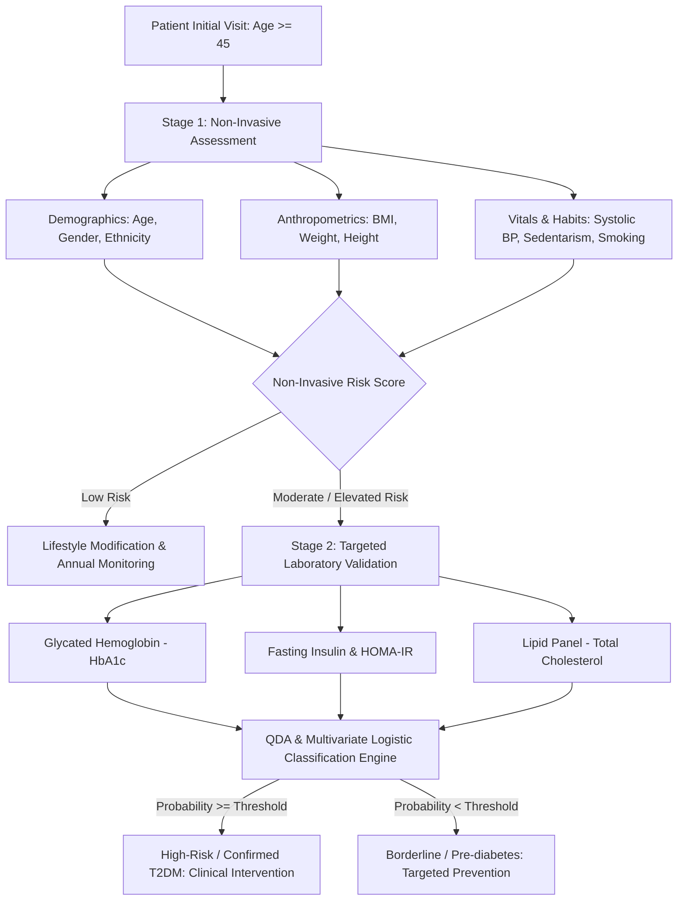

# Demographic, Clinical, and Lifestyle Factors in Diabetes Risk Prediction: A Multivariate Statistical Modeling & Machine Learning Approach

[](https://www.r-project.org/)
[](https://rmarkdown.rstudio.com/)
[](https://wwwn.cdc.gov/nchs/nhanes/continuousnhanes/default.aspx?BeginYear=2013)
[](https://opensource.org/licenses/MIT)
[]()

> **Language Versions:** [English](README.md) | [Español](README.es.md)

---

## Executive Summary

Type 2 Diabetes Mellitus (T2DM) represents one of the most pressing global public health challenges, characterized by chronic hyperglycemia, insulin resistance, and progressive metabolic dysregulation. While definitive clinical diagnosis relies on invasive laboratory biomarkers—primarily Glycated Hemoglobin ($\text{HbA1c}$), Fasting Plasma Glucose (FPG), and Oral Glucose Tolerance Tests (OGTT)—universal blood-based screening in primary care settings is often constrained by economic costs, logistical barriers, and diagnostic turnaround times.

This project delivers an end-to-end **multivariate statistical and machine learning framework** to evaluate how non-invasive demographic, anthropometric, and lifestyle factors can guide clinical decision-making and optimize secondary laboratory testing. Utilizing the **CDC National Health and Nutrition Examination Survey (NHANES 2013–2014)** filtered to middle-aged and older adults ($\text{Age} \ge 45$, $N = 3,174$), we integrate:
1. **Multivariate Analysis of Variance (MANOVA)** to demonstrate systemic metabolic separation across diabetic and non-diabetic populations ($p < 2.2 \times 10^{-16}$).
2. **Exploratory Factor Analysis (EFA)** with oblique rotation to isolate 3 core latent pathophysiological dimensions: *Dietary Factor*, *Vascular Aging*, and *Metabolic/Clinical Core*.
3. **Principal Component Analysis (PCA)** identifying 4 orthogonal components accounting for $69.7\%$ of total variance.
4. **Quadratic Discriminant Analysis (QDA)** handling class imbalance via up-sampling and modeling group covariance heteroscedasticity, achieving an overall accuracy of **$84.72\%$**, a specificity of **$94.27\%$**, and an NPV of **$87.09\%$**.
5. **Hierarchical Logistic Regression Modeling** comparing non-invasive baseline screening ($\text{AUC} = 0.6497, \text{AIC} = 813.99$) against full clinical laboratory integration ($\text{AUC} = 0.8765, \text{AIC} = 564.65$).

The final synthesis proposes a **Two-Stage Clinical Screening Protocol**: non-invasive community-level triage followed by targeted laboratory confirmation prioritizing $\text{HbA1c}$ and lipid panels.



---

## Authors & Academic Context

* **Authors:**
  * **Samuel Santiago Arandia Barragán**
  * **Juan David Castañeda Betancourt**
  * **Juan Felipe Rojas Manjarres**
* **Institution:** Universidad del Rosario (Bogotá, Colombia)
* **Academic Course:** *Análisis Estadístico de Datos (AED)* — 2026-1
* **Faculty Advisor:** Prof. Luz Adriana Pineda
* **Repository:** [https://github.com/JuanFeletes24/AED_PROJECT](https://github.com/JuanFeletes24/AED_PROJECT)
* **Full Academic Paper:** [`docs/AED.pdf`](docs/AED.pdf)

---

## Research Question & Hypotheses

### Primary Research Question
> *To what extent can accessible, non-invasive variables (demographics, anthropometrics, lifestyle habits, and dietary intake) guide the targeted selection of specialized clinical laboratory tests, and how accurately can the resulting integrated feature space predict diabetes status in adults aged 45 and older?*

### Statistical Hypotheses
* **Hypothesis 1 (Multivariate Group Separation):** The multivariate mean vector $\boldsymbol{\mu}_{\text{diabetic}}$ differs significantly from $\boldsymbol{\mu}_{\text{non-diabetic}}$ across joint metabolic, cardiovascular, and dietary indicators ($H_0: \boldsymbol{\mu}_1 = \boldsymbol{\mu}_2$).
* **Hypothesis 2 (Latent Factor Dimensionality):** The observed correlation matrix of clinical and behavioral variables can be parsimoniously explained by distinct latent dimensions representing dietary intake, vascular aging, and glycemic control.
* **Hypothesis 3 (Predictive Synergism):** While non-invasive predictors provide substantial triage capability ($\text{AUC} \approx 0.65$), combining them with targeted biomarkers produces high-precision diagnostic discrimination ($\text{AUC} \ge 0.87$).

---

## Dataset Architecture & Preprocessing

The study utilizes cross-sectional microdata from the **National Health and Nutrition Examination Survey (NHANES 2013–2014)** administered by the National Center for Health Statistics (NCHS) / Centers for Disease Control and Prevention (CDC).

```
+---------------------------------------------------------------------------------------+
|                               CDC NHANES 2013–2014                                    |
|                     (Initial Sample Size: N = 10,175 individuals)                     |
+-------------------+-------------------+-------------------+-------------------+-------+
        |                   |                   |                   |                   |
        v                   v                   v                   v                   v
+---------------+   +---------------+   +---------------+   +---------------+   +---------------+
| questionnaire |   |     labs      |   |  examination  |   |  demographic  |   |     diet      |
|  (DIQ, SMQ,   |   |   (HbA1c,     |   |  (BMI, BP,    |   |  (Age, Sex,   |   | (Carbs, Fiber |
|     PAQ)      |   |  Insulin, TC) |   |  Weight, Ht)  |   |   Ethnicity)  |   |   Intake)     |
+---------------+   +---------------+   +---------------+   +---------------+   +---------------+
        |                   |                   |                   |                   |
        +-------------------+--------+----------+-------------------+-------------------+
                                     |
                                     v Inner Join on Primary Key: SEQN
                    +-----------------------------------+
                    |   Merged Multimodal Master Table  |
                    +-----------------------------------+
                                     |
                                     v Filter: RIDAGEYR >= 45 years
                    +-----------------------------------+
                    | Target Population: N = 3,174 obs  |
                    +-----------------------------------+
                                     |
                                     v Complete Case / Imputation Pipeline
                    +-----------------------------------+
                    | Multivariate Analytic Dataset     |
                    | (N = 1,202 complete observations) |
                    +-----------------------------------+
```

### Data Dictionary

| Variable Code | Standardized Name | Domain / Source | Scale Type | Clinical / Operational Definition | Reference Range / Units |
| :--- | :--- | :--- | :--- | :--- | :--- |
| `SEQN` | `Id` | Master Key | Discrete Nominal | Unique Participant Identification Sequence Number | $73557 - 83731$ |
| `DIQ010` | `Diabetes_diagnostized` | Questionnaire | Categorical Nominal | Doctor-diagnosed diabetes status | `1` = Yes, `2` = No, `3` = Borderline |
| `SMQ020` | `Smoked_100_cigarrette`| Questionnaire | Categorical Nominal | Lifetime smoking exposure ($\ge 100$ cigarettes) | `1` = Yes, `2` = No |
| `PAQ650` | `Sport` | Questionnaire | Categorical Nominal | Engagement in vigorous physical activity / sports | `1` = Yes, `2` = No |
| `RIAGENDR` | `Gender` | Demographic | Categorical Nominal | Biological sex | `Male`, `Female` |
| `RIDRETH3` | `Ethnicity` | Demographic | Categorical Nominal | Race / Hispanic origin recode | 6 categories |
| `DMDEDUC2` | `Education` | Demographic | Ordinal | Educational attainment level | 5 ordered categories |
| `RIDAGEYR` | `Age` | Demographic | Continuous Ratio | Chronological age at examination | $\ge 45$ years ($45 - 80$) |
| `BMXWT` | `Weight` | Examination | Continuous Ratio | Body weight | $\text{kg}$ |
| `BMXHT` | `Height` | Examination | Continuous Ratio | Standing height | $\text{cm}$ |
| `BMXBMI` | `BMI` | Examination | Continuous Ratio | Body Mass Index ($\text{kg}/\text{m}^2$) | Normal: $18.5 - 24.9$ |
| `BPXSY1` | `Blood_pressure` | Examination | Continuous Ratio | Systolic blood pressure (1st reading) | $\text{mmHg}$ |
| `LBXGH` | `Glycohemoglobin` | Laboratory | Continuous Ratio | Glycated hemoglobin ($\text{HbA1c}$) percentage | Normal: $< 5.7\%$, Diabetes: $\ge 6.5\%$ |
| `LBXTC` | `Cholesterol` | Laboratory | Continuous Ratio | Serum Total Cholesterol | Normal: $< 200\text{ mg/dL}$ |
| `LBXIN` | `Insulina` | Laboratory | Continuous Ratio | Fasting serum insulin | $\mu\text{IU/mL}$ |
| `DR1TCARB` | `Carbohydrate` | Dietary Recall | Continuous Ratio | Total daily carbohydrate intake | $\text{grams/day}$ |
| `DR1TFIBE` | `Fiber` | Dietary Recall | Continuous Ratio | Total daily dietary fiber intake | $\text{grams/day}$ |

---

## Exploratory Data Analysis & Empirical Findings

### 1. Response Variable Class Imbalance
In the target population ($\text{Age} \ge 45$):
* **No Diabetes ($76.2\%$):** Undiagnosed / non-diabetic cohort ($N = 2,419$).
* **Diagnosed Diabetes ($19.5\%$):** Confirmed clinical diabetes ($N = 619$).
* **Borderline / Pre-diabetes ($4.2\%$):** Impaired glycemic regulation ($N = 133$).
* **Analytical Treatment:** For binary discriminant and logistic modeling, classes were structured into **$\text{Risk}$** ($1$) vs **$\text{No\_Risk}$** ($0$). Training sets were synthetically balanced using stratified up-sampling to prevent majority-class bias.

### 2. Behavioral Risk Drivers: Physical Activity & Sedentarism
Cross-tabulation reveals that sedentary lifestyle dramatically elevates clinical risk:
* **Sedentary Population:** $\approx 21.0\%$ diagnosed diabetes prevalence.
* **Physically Active Population:** $\approx 9.6\%$ diagnosed diabetes prevalence.
* *Finding:* Sedentary individuals exhibit **more than double ($2.18\times$)** the prevalence of diabetes compared to physically active peers.

### 3. Distributional Metrics of Quantitative Biomarkers
* **$\text{HbA1c}$:** Marked right-skewness ($\text{skew} > 0$). Median values reside near pre-diabetic thresholds, while the right-tail exhibits high clinical stability and discriminatory potential.
* **Fasting Insulin, Carbohydrates, and Fiber:** High variance and heavy right tails reflecting broad behavioral and metabolic heterogeneity.
* **Systolic Blood Pressure & BMI:** Moderate right-skewness with clear upward shifts in median and interquartile ranges (IQR) within the diabetic cohort.

---

## Multivariate Hypothesis Testing & ANOVA

### 1. Multivariate Normality & Homoscedasticity Assumptions
* **Mardia Test for Multivariate Normality:** Rejection of multivariate normality ($p < 0.001$), driven by skewness in insulin and dietary variables. Robust estimators and non-parametric validations were applied.
* **Box's M Test for Equality of Covariance Matrices:**
  $$\text{Box's } M = 293.42, \quad F \approx 36.19, \quad p < 2.2 \times 10^{-16}$$
  The null hypothesis $H_0: \boldsymbol{\Sigma}_{\text{Risk}} = \boldsymbol{\Sigma}_{\text{No\_Risk}}$ is decisively rejected. **This result formally justifies Quadratic Discriminant Analysis (QDA) over Linear Discriminant Analysis (LDA).**

### 2. Multivariate Analysis of Variance (MANOVA)
Testing global differences in centroid vectors between diabetes risk groups across 8 quantitative variables ($\text{HbA1c}$, Insulin, Cholesterol, SBP, BMI, Age, Carbs, Fiber):

$$\text{Pillai's Trace} = 0.3596, \quad F(8, 1193) = 83.75, \quad p < 2.2 \times 10^{-16}$$

$$\text{Wilks' Lambda } \Lambda = 0.6404, \quad F(8, 1193) = 83.75, \quad p < 2.2 \times 10^{-16}$$

### 3. Follow-up Univariate ANOVAs
Given MANOVA significance, univariate ANOVAs (with Levene tests for variance equality) identified individual group separations:
* **$\text{HbA1c}$ ($F = 562.4, p < 10^{-15}$):** Most significant univariate discriminator.
* **Insulin ($F = 114.8, p < 10^{-15}$):** Strong metabolic hyperinsulinemia indicator.
* **BMI ($F = 46.2, p = 1.6 \times 10^{-11}$):** Significant anthropometric risk driver.
* **Systolic Blood Pressure ($F = 28.7, p = 1.0 \times 10^{-7}$):** Key vascular comorbidity.
* **Age ($F = 19.4, p = 1.1 \times 10^{-5}$):** Significant biological aging effect.

---

## Latent Dimensionality: EFA & PCA

### 1. Exploratory Factor Analysis (EFA)
* **Factor Selection:** Horn's Parallel Analysis on the empirical correlation matrix indicated **3 latent factors**.
* **Extraction & Rotation:** Maximum Likelihood (ML) extraction with oblique **Direct Oblimin** rotation ($\delta = 0$), accounting for $42.1\%$ of common variance.

| Latent Dimension | Variable | Factor Loading ($\lambda_j$) | Uniqueness ($u_j^2$) | Clinical / Pathophysiological Interpretation |
| :--- | :--- | :--- | :--- | :--- |
| **Factor 1 ($\text{ML}1$)**<br>*Metabolic & Glycemic Core* | Fasting Insulin (`LBXIN`)<br>Body Mass Index (`BMXBMI`)<br>$\text{HbA1c}$ (`LBXGH`) | **0.74**<br>**0.45**<br>**0.42** | 0.44<br>0.79<br>0.82 | Captures acute insulin resistance, adiposity-driven metabolic stress, and chronic glycemic control. |
| **Factor 2 ($\text{ML}2$)**<br>*Vascular & Biological Aging* | Systolic BP (`BPXSY1`)<br>Age (`RIDAGEYR`)<br>Total Cholesterol (`LBXTC`) | **0.66**<br>**0.52**<br>**0.29** | 0.56<br>0.72<br>0.91 | Reflects age-dependent arterial stiffening, vascular compliance loss, and lipid dysregulation. |
| **Factor 3 ($\text{ML}3$)**<br>*Macronutrient Dietary Intake* | Carbohydrates (`DR1TCARB`)<br>Dietary Fiber (`DR1TFIBE`) | **0.98**<br>**0.65** | 0.03<br>0.57 | Represents total caloric density, carbohydrate loading, and dietary fiber intake. |

### 2. Principal Component Analysis (PCA)
* **Kaiser-Guttman Criterion:** 4 principal components exhibited eigenvalues $\lambda_k > 1.0$, jointly explaining **$69.7\%$** of total system variance:
  * **$\text{PC}_1$ ($21.8\%$ var):** Nutritional / Dietary magnitude component (Carbohydrates & Fiber).
  * **$\text{PC}_2$ ($18.4\%$ var):** Glycemic-Metabolic burden ($\text{HbA1c}$, Insulin, BMI).
  * **$\text{PC}_3$ ($15.1\%$ var):** Cardiovascular & Demographic aging (Age, Systolic BP).
  * **$\text{PC}_4$ ($14.4\%$ var):** Lipidic / Metabolic profile (Total Cholesterol).

---

## Predictive Modeling & Classification

### 1. Quadratic Discriminant Analysis (QDA)

Because Box's M rejected covariance equality ($\boldsymbol{\Sigma}_1 \neq \boldsymbol{\Sigma}_2$), the quadratic decision boundary was evaluated:

$$\delta_k(\mathbf{x}) = -\frac{1}{2} \ln |\boldsymbol{\Sigma}_k| - \frac{1}{2} (\mathbf{x} - \boldsymbol{\mu}_k)^T \boldsymbol{\Sigma}_k^{-1} (\mathbf{x} - \boldsymbol{\mu}_k) + \ln \pi_k$$

* **Data Partitioning:** $70\%$ Training ($N = 842$), $30\%$ Testing ($N = 360$).
* **Training Class Balancing:** Stratified up-sampling of the minority class ($\text{Risk}$) produced a balanced training set of $N_{\text{train}} = 1,864$ observations.

#### Test Set Performance Metrics ($N = 360$)

| Evaluation Metric | Mathematical Definition | Value | 95% Confidence Interval |
| :--- | :--- | :--- | :--- |
| **Overall Accuracy** | $\frac{TP + TN}{N}$ | **84.72%** | $[80.58\%, 88.28\%]$ |
| **Specificity** | $\frac{TN}{TN + FP}$ | **94.27%** | $[90.75\%, 96.76\%]$ |
| **Negative Predictive Value (NPV)** | $\frac{TN}{TN + FN}$ | **87.09%** | $[82.68\%, 90.72\%]$ |
| **Sensitivity (Recall)** | $\frac{TP}{TP + FN}$ | **51.85%** | $[40.75\%, 62.81\%]$ |
| **Positive Predictive Value (PPV)** | $\frac{TP}{TP + FP}$ | **72.41%** | $[59.10\%, 83.33\%]$ |
| **Balanced Accuracy** | $\frac{\text{Sensitivity} + \text{Specificity}}{2}$ | **73.06%** | — |
| **Cohen's Kappa ($\kappa$)** | $\frac{P_o - P_e}{1 - P_e}$ | **0.513** | Moderate-to-Substantial Agreement |

```
                CONFUSION MATRIX (QDA Test Set)
                ---------------------------------
                           Actual No_Risk    Actual Risk
   Predicted No_Risk            263              39        => NPV = 87.09%
   Predicted Risk                16              42        => PPV = 72.41%
                               ------          ------
                               Sp=94.27%       Sn=51.85%
```

---

### 2. Hierarchical Binary Logistic Regression

Two nested logistic models were specified to evaluate the incremental diagnostic yield of invasive laboratory tests:

$$\ln\left(\frac{P(Y=1)}{1 - P(Y=1)}\right) = \beta_0 + \sum_{j=1}^p \beta_j X_j$$

#### Model Comparison Summary

| Model Specification | Predictor Set | AIC | Residual Deviance | AUC (ROC) | Likelihood Ratio Test vs Basic |
| :--- | :--- | :--- | :--- | :--- | :--- |
| **Basic Model (Non-Invasive)** | Age, Gender, Ethnicity, Education, Physical Activity, Smoking, BMI, SBP, Carbs, Fiber | **813.99** | 791.99 ($df=1190$) | **0.6497** | Reference |
| **Full Model (+ Laboratory Tests)** | Basic Predictors + Total Cholesterol, $\text{HbA1c}$, Fasting Insulin | **564.65** | 536.65 ($df=1187$) | **0.8765** | $\chi^2 = 255.34, p < 2.2 \times 10^{-16}$ |

#### Odds Ratios & Parameter Estimates (Full Model)

| Parameter / Feature | Coefficient ($\beta$) | Std. Error | $z$-statistic | $p$-value | Odds Ratio ($e^\beta$) | 95% CI (OR) |
| :--- | :--- | :--- | :--- | :--- | :--- | :--- |
| **$\text{HbA1c}$ (`LBXGH`)** | **+1.9006** | **0.1706** | **11.14** | **$< 2 \times 10^{-16}$** | **6.69** | $[4.79, 9.35]$ |
| **Body Mass Index (`BMI`)** | **+0.0432** | **0.0159** | **2.72** | **0.0066** | **1.04** | $[1.01, 1.08]$ |
| **Systolic BP (`BPXSY1`)** | **+0.0128** | **0.0058** | **2.21** | **0.0272** | **1.01** | $[1.00, 1.02]$ |
| **Age (`RIDAGEYR`)** | **+0.0241** | **0.0102** | **2.36** | **0.0183** | **1.02** | $[1.00, 1.05]$ |
| **Total Cholesterol (`LBXTC`)** | **-0.0071** | **0.0028** | **-2.54** | **0.0111** | **0.99** | $[0.98, 0.99]$ |
| **Fasting Insulin (`LBXIN`)** | **+0.0052** | **0.0039** | **1.33** | **0.1835** | **1.00** | $[0.99, 1.01]$ |
| **Physical Activity (`Sport: Yes`)**| **-0.3421** | **0.1985** | **-1.72** | **0.0854** | **0.71** | $[0.48, 1.05]$ |

> **Key Epidemiological Interpretation:** For every **$1.0\%$ increase in $\text{HbA1c}$**, the odds of diagnosed diabetes multiply by **$6.69\times$** ($+569\%$), controlling for all demographic, behavioral, and clinical covariates.

---

## Two-Stage Clinical Screening Protocol

```
+---------------------------------------------------------------------------------------------------+
|                               STAGE 1: NON-INVASIVE COMMUNITY TRIAGE                              |
| Setting: Primary Care, Telemedicine, or Community Health Clinics                                  |
| Cost: $0 (No blood draw required) | Time: < 10 minutes                                            |
+---------------------------------------------------------------------------------------------------+
| - Screen Patients Age >= 45                                                                       |
| - Collect: Chronological Age, Body Mass Index (BMI), Systolic Blood Pressure                      |
| - Screen for Vigorous Physical Activity (PAQ650) & Lifestyle Habits                               |
| - Compute Non-Invasive Linear Risk Predictor (AUC = 0.65)                                         |
+---------------------------------------------------------------------------------------------------+
                                                  |
                                                  v
                   +-------------------------------------------------------------+
                   | Risk Categorization via Non-Invasive Boundary               |
                   +-------------------------------------------------------------+
                            /                                           \
                           /                                             \
        [ Non-Invasive Risk < Cutoff ]                         [ Non-Invasive Risk >= Cutoff ]
                      |                                                           |
                      v                                                           v
+-------------------------------------------+               +-------------------------------------------+
|          LOW RISK TRAJECTORY              |               |         ELEVATED RISK TRAJECTORY          |
| - Annual routine clinical checkup         |               | - Fast-track referral to STAGE 2          |
| - Primary prevention & physical activity  |               | - Order targeted laboratory panel         |
| - No invasive blood testing required      |               +-------------------------------------------+
+-------------------------------------------+                                     |
                                                                                  v
+---------------------------------------------------------------------------------------------------+
|                               STAGE 2: TARGETED LABORATORY VALIDATION                             |
| Setting: Clinical Diagnostic Laboratory / Endocrinology                                           |
| Cost: Minimized (Targeted biomarkers only)                                                        |
+---------------------------------------------------------------------------------------------------+
| Priority 1: Glycated Hemoglobin (HbA1c) — Primary Discriminator (OR = 6.69, p < 10^-15)           |
| Priority 2: Total Serum Cholesterol & Lipid Profile — Metabolic Comorbidity                       |
| Priority 3: Fasting Serum Insulin / HOMA-IR Calculation                                           |
| Compute Integrated Multimodal Risk (QDA Specificity = 94.27%, Full Logistic AUC = 0.8765)         |
+---------------------------------------------------------------------------------------------------+
```

---

## Repository Structure

```
AED_PROJECT/
├── README.md                      # Master documentation (English)
├── README.es.md                   # Complete Spanish documentation
├── LICENSE                        # MIT License
├── .gitignore                     # Git ignore rules for R environments
├── NHANES.Rmd                     # Comprehensive R Markdown script (1580+ lines)
├── NHANES.html                    # Knitted HTML research report with interactive tables & figures
├── data/                          # Raw CDC NHANES 2013-2014 microdata modules
│   ├── demographic.csv            # Demographics (Age, Gender, Ethnicity, Education)
│   ├── diet.csv                   # 24-hour dietary recall (Carbohydrates, Dietary Fiber)
│   ├── examination.csv            # Physical exams (BMI, Weight, Height, Systolic BP)
│   ├── labs.csv                   # Laboratory biomarkers (HbA1c, Cholesterol, Insulin)
│   ├── medications.csv            # Prescription medications
│   └── questionnaire.csv          # Health questionnaires (Diabetes, Smoking, Physical Activity)
└── docs/                          # Academic documentation & presentations
    ├── AED.pdf                    # Final complete academic research paper (14 pages)
    ├── AED.docx                   # Word manuscript version
    ├── Prediccion_Diabetes_Presentacion.pptx # Project presentation slide deck
    ├── Guion_Detallado_Diabetes.md # Detailed oral defense script
    ├── Entrega1_AED.pdf           # Milestone 1 submission
    ├── Entrega2_AED.docx          # Milestone 2 submission
    └── RúbircaAED_2026-1.pdf      # Course grading rubric & academic guidelines
```

---

## Reproducibility & Execution

### Prerequisites
* R version $\ge 4.3.0$
* RStudio Desktop (recommended) or R CLI

### 1. Clone the Repository
```bash
git clone https://github.com/JuanFeletes24/AED_PROJECT.git
cd AED_PROJECT
```

### 2. Install Required R Packages
Open R or RStudio and execute:
```r
required_packages <- c(
  "dplyr", "ggplot2", "tidyr", "knitr", "kableExtra", 
  "corrplot", "GGally", "patchwork", "car", "caret", 
  "pROC", "MASS", "FactoMineR", "factoextra", "ca", 
  "treemapify", "psych", "biotools", "heplots"
)

installed <- rownames(installed.packages())
to_install <- setdiff(required_packages, installed)
if (length(to_install) > 0) install.packages(to_install)
```

### 3. Knit the Full Analysis
```r
rmarkdown::render("NHANES.Rmd", output_format = "html_document")
```

---

## References

1. **Centers for Disease Control and Prevention (CDC) & National Center for Health Statistics (NCHS).** *National Health and Nutrition Examination Survey (NHANES) 2013–2014 Data Documentation, Codebooks, and SAS Datasets.* Hyattsville, MD: U.S. Department of Health and Human Services.
2. **American Diabetes Association (ADA).** (2024). *Standards of Care in Diabetes—2024.* Diabetes Care, 47(Suppl. 1), S1–S343.
3. **Johnson, R. A., & Wichern, D. W.** (2007). *Applied Multivariate Statistical Analysis* (6th ed.). Pearson Prentice Hall.
4. **Hosmer, D. W., Lemeshow, S., & Sturdivant, R. X.** (2013). *Applied Logistic Regression* (3rd ed.). John Wiley & Sons.
5. **Venables, W. N., & Ripley, B. D.** (2002). *Modern Applied Statistics with S* (4th ed.). Springer.

---

## Citation

If you reference this work or utilize the modeling pipeline in academic research, please cite:

```bibtex
@misc{arandia_castaneda_rojas_2026_aed,
  author       = {Arandia Barrag{\'a}n, Samuel Santiago and Casta{\~n}eda Betancourt, Juan David and Rojas Manjarres, Juan Felipe},
  title        = {An{\'a}lisis de Factores Demogr{\'a}ficos, Cl{\'i}nicos y de Estilo de Vida en la Predicci{\'o}n del Riesgo de Diabetes: Modelado Multivariado y Aprendizaje Autom{\'a}tico con NHANES},
  year         = {2026},
  publisher    = {GitHub},
  journal      = {GitHub repository},
  howpublished = {\url{https://github.com/JuanFeletes24/AED_PROJECT}},
  institution  = {Universidad del Rosario}
}
```

---
*Developed with rigorous statistical methods for academic excellence at Universidad del Rosario.*
